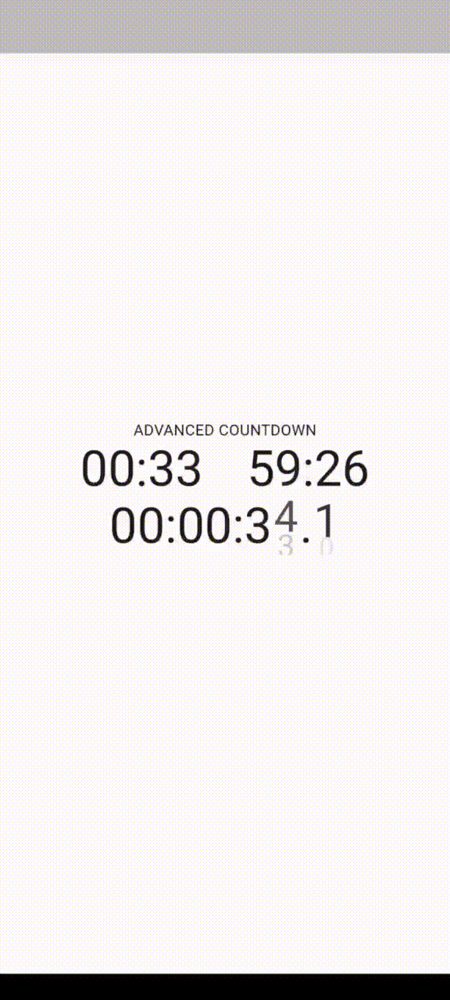

# advanced_countdown

An advanced countdown widget that displays time with digit animation.

## AdvancedCountdown Parameters
| Parameter                       | Description          | Type                                  | Required | Default                              |
|:--------------------------------|:---------------------|:--------------------------------------|:---------|:-------------------------------------|
| `value`                         | The value to display | *Duration*                            | false    | Duration.zero                        |
| `animationDuration`             | The value to display | *Duration*                            | false    | defaultAnimationDuration             |
| `animationMillisecondsDuration` | The value to display | *Duration*                            | false    | defaultMillisecondsAnimationDuration |
| `transitionBuilder`             | The value to display | *AnimatedSwitcherTransitionBuilder?*  | false    | (default transition)                 |
| `style`                         | The value to display | *TextStyle?*                          | false    | DefaultTextStyle.of(context).style   |
| `displayHours`                  | The value to display | *bool*                                | false    | false                                |
| `displayMilliseconds`           | The value to display | *bool*                                | false    | false                                |
| `millisecondsLength`            | The value to display | *int*                                 | false    | 1                                    |

